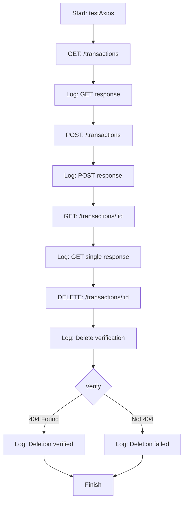

# test_axios.js 작업 흐름도

## 작업 순서 및 관계
1. **GET (전체 조회):** 전체 트랜잭션 데이터를 가져와 상위 5개를 출력합니다.
2. **POST (생성):** 새로운 가계부 항목을 추가하고, 서버가 반환한 새로운 항목의 ID를 저장합니다.
3. **GET (단일 조회):** 방금 생성한 ID를 사용하여 해당 데이터가 정상적으로 생성되었는지 확인합니다.
4. **DELETE (삭제):** 해당 ID의 데이터를 삭제합니다.
5. **Verify (검증):** 삭제된 ID로 다시 조회 시 404(Not Found) 오류가 발생하는지 확인하여 삭제 처리를 검증합니다.
